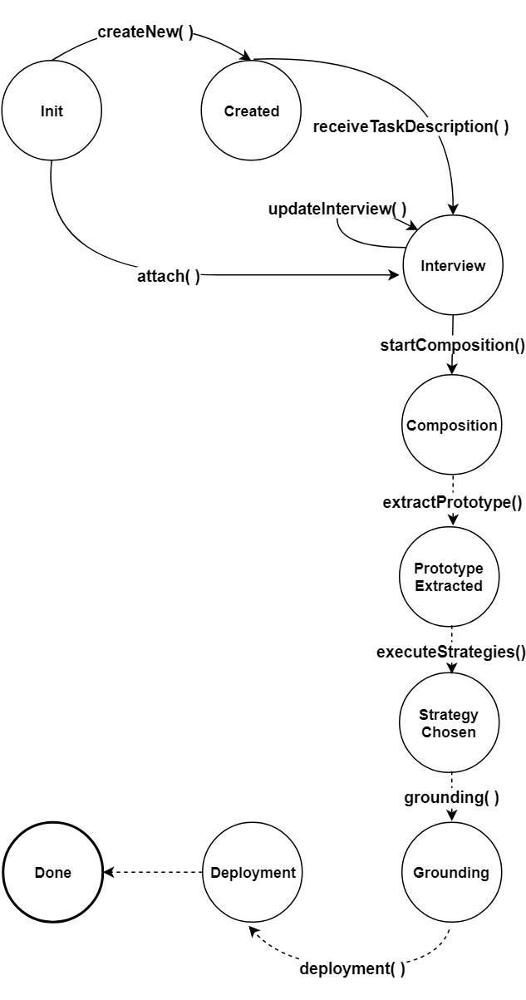

PROSECO is a gradle project implemented in java, it consist of three submodules:
### Commons:
Commons submodule contains the common functionality required by the core and web server modules.
Here we explain some of the most important capabilities it provides:
- **Config**:
Config package contains configuration parameters and default values for these parameters. 
- **Controller**:
Controller package contains the interface definitions that guide the implementation of concrete controllers.
- **Interview**:
`Interview` is the medium that PROSECO uses to gather information from the user.
It contains a list of questions and their answers. Questions are showed to the user
as HTML elements. Interview is defined as a set of states (just like an automaton), 
so answering the questions in a state leads to a state increment. `InterviewFillout` contains the answers to the interview questions.
- **Process Status**:
PROSECO operates in predefined states (`EProcessState`) which is controlled by `ProcessStateTransitionController`.
- **Parser**: Parses the interview description.
- **PROSECOProcessEnvironment**: When an instance of the selected prototype is initiated, `PROSECOProcessEnvironment` is created. 
It maintains the directories necessary to execute the prototype. This execution is referred as *process*, PROSECOProcessEnvironment of a process is accessed by the *processID*.

### Core:
Core submodule contains the implementation of the composition logic of PROSECO.

- **FileBasedConfigurationProcess**: `FileBasedConfigurationProcess` is an implementation of the `ProcessController` interface defined in the commons submodule.
In FileBasedConfigurationProcess, domain is set from outside using the domain selection provided in the interview. The figure below shows the process state transitions
during the configuration process. The a new process is created and a processId is generated when the `createNew()` method is called, this method can also be called with an ID (`createNew(processId)`)
in that case given ID will be used for the process. The domain of the process is defined by calling the `fixDomain()` method, after that interview update can be received with `updateInterview()` method.
Once answering the interview is done, `startComposition()` method should be called to start the composition process. When the composition process started; prototype extraction, execution of the strategies,
grounding and deployment states will be handled internally. At the end of the deployment configuration process will be done.

- **NaturalLanguageSupportingConfigurationProcess**: `NaturalLanguageSupportingConfigurationProcess` is another implementation of the `ProcessController` interface.
In NaturalLanguageSupportingConfigurationProcess, a text description is provided to the controller and the domain is extracted from this description. As can be seen in the 
figure below; instead of fixing the domain from the outside, NaturalLanguageSupportingConfigurationProcess handles fixing the domain internally and also extracts interview anwers
from the given general task description.

- **StrategyExecutor**: `StrategyExecutor` executes the strategies defined for a prototype. At the end of the execution of a strategy output of the strategy, including 
a success score, is stored. After all the strategies complete their execution, best strategy is choosen depending on their scores.

### Web Server:
Web Server submodule makes PROSECO available as a web application, it is implemented with Spring Boot framework.
- **PROSECOServer**: The entry point to the web server is `PROSECOServer`, it must run as java application and the server will be accessible at `http://localhost:8080`.
- **InterviewController**: `InterviewController` manages the user's interaction with the PROSECO web server. It displays the `Interview` to the user, and forwards user's answers.
- **APIController**: `APIController` manages the APIs published by PROSECO. Mainly used for monitoring purpose e.g. for process status and outputs of the strategies.
